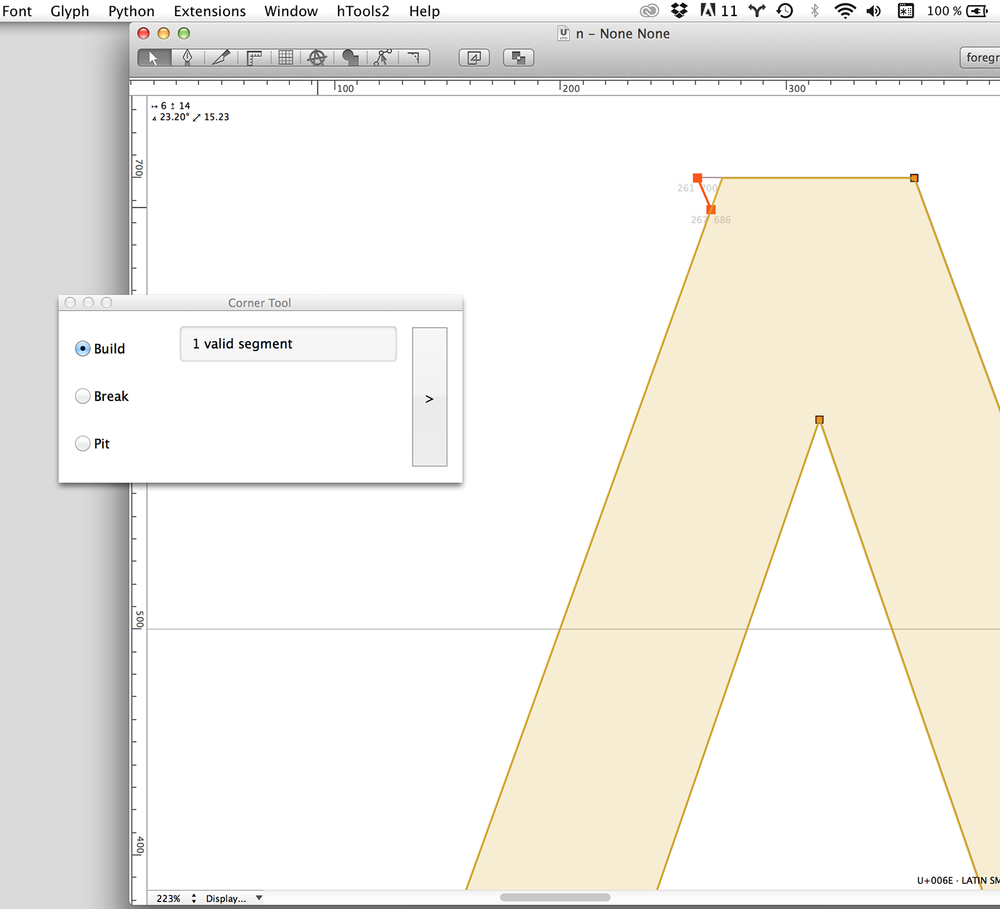
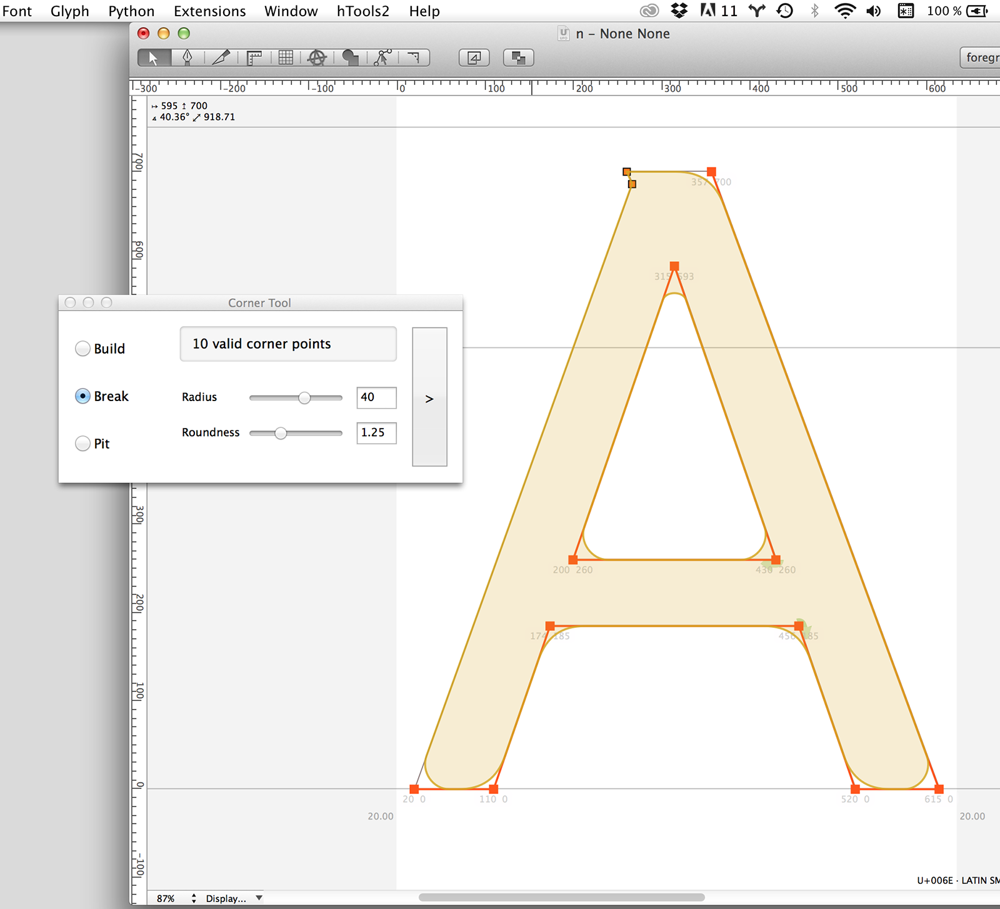
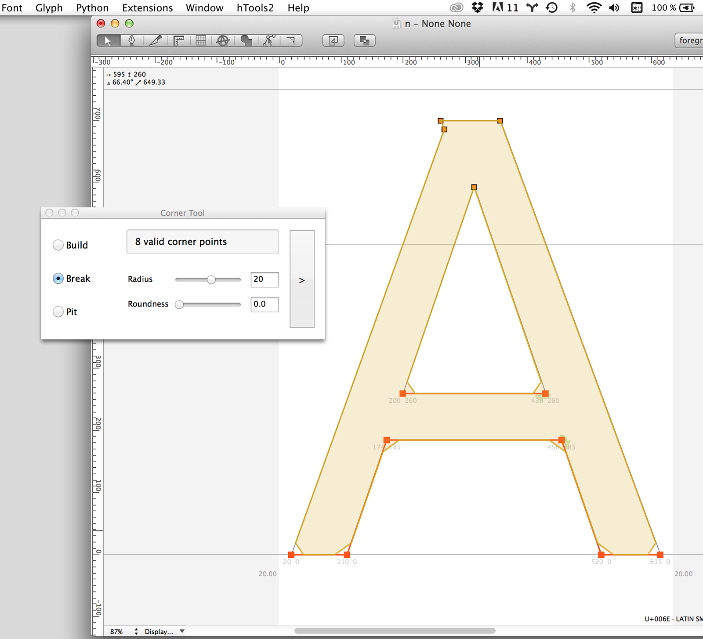
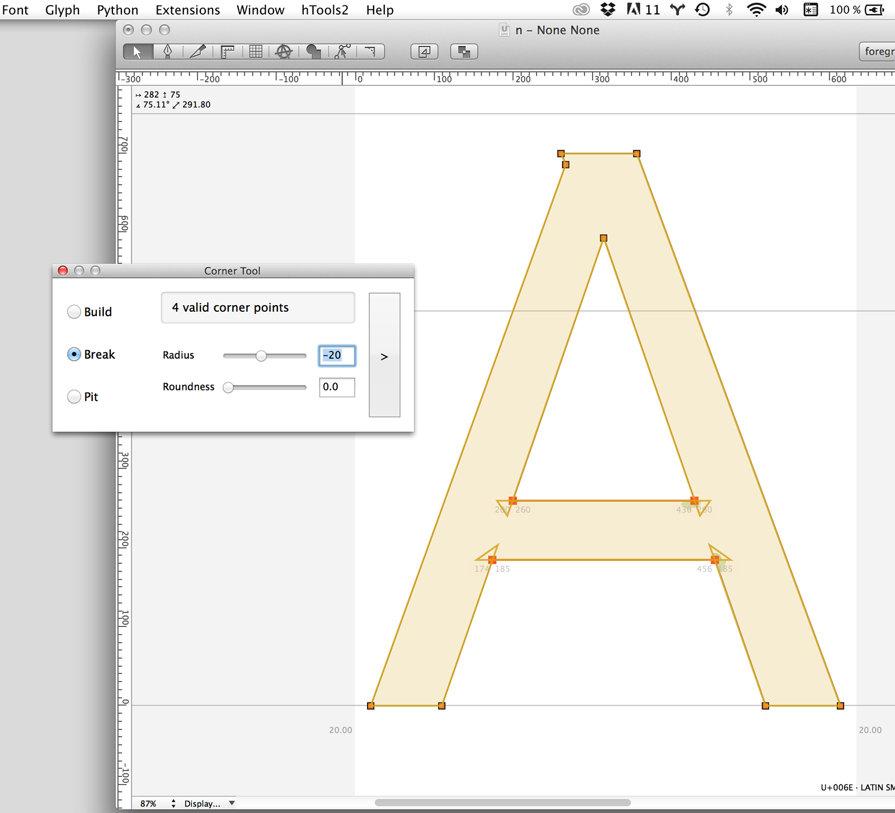
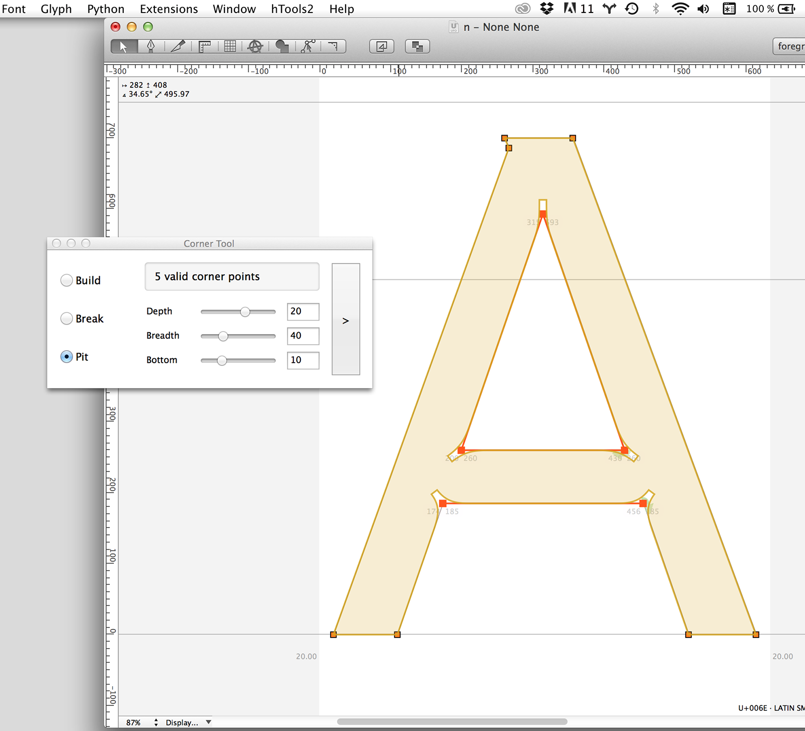

## Corner Tools
================

This extension is a set of tools to work on corners of an outline. It comprises a tool available in the glyph editing view that allows you to round/cut corners by dragging to define the radius, and a pop-up window (accessible via the Extensions menu, under Corner Tools) which provides a more global set of controls.

### Glyph view rounding tool

#### Actions
+ **Double-click**: apply rounding
+ **Command+Double-click**: reset all radiuses

#### Holding modifier keys
+ **Shift**: radius steps 5 by 5
+ **Option**: make a flat corner rather than round
+ **Shift**+**Command**: reset radius

### Corner Tools controller

The controller works as a wysiwyg corner editor, working with point selection. There are three modes:

#### Build
Needs a selection of one or several segments and will try to grow new corners where it can. Results may vary.

#### Break
This mode allows similar operations to what the rounding tool but with finer control and the ability to apply the same value to several corners at once. The two parameters allow you to do a number of things:

#### Break
This mode implements ‘ink-traps’ or ’light-wells’ or whatever name fits your ideology. Having no opinion on the matter, I decided to take on another term, pits. Something wicked this way comes.

