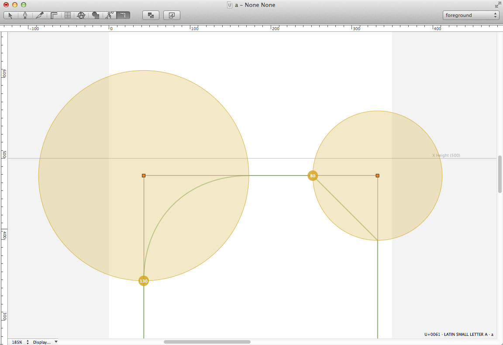
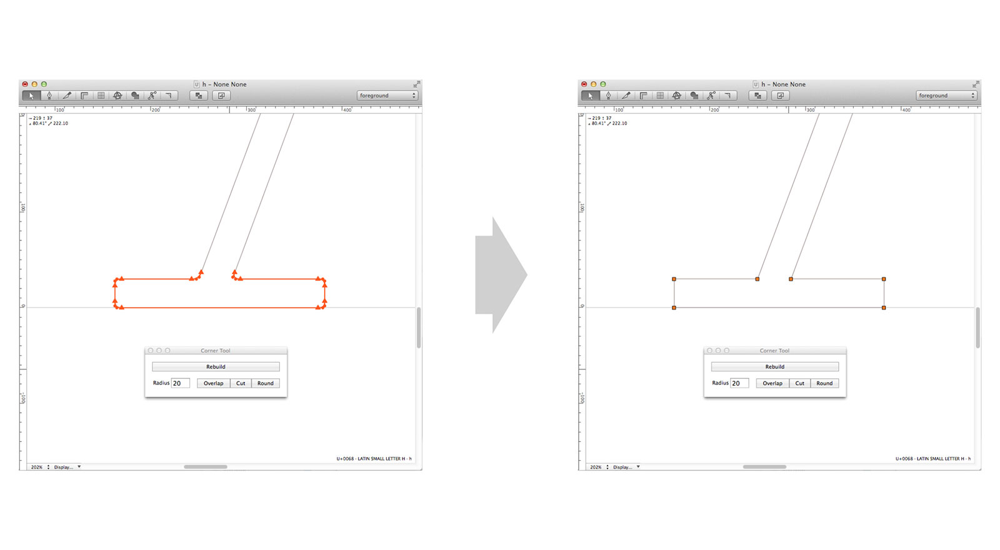
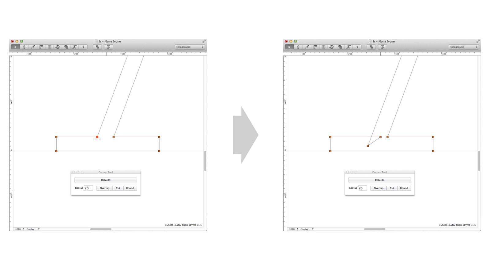
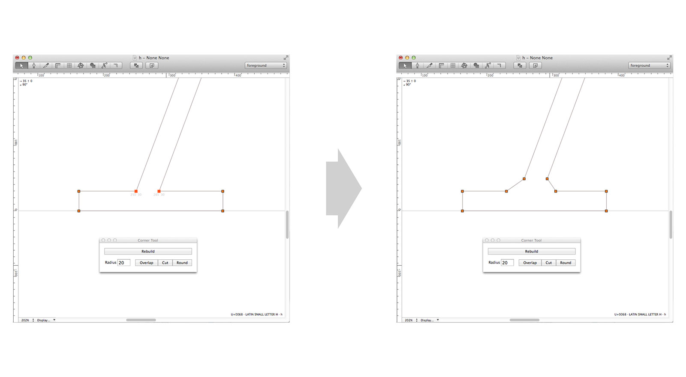
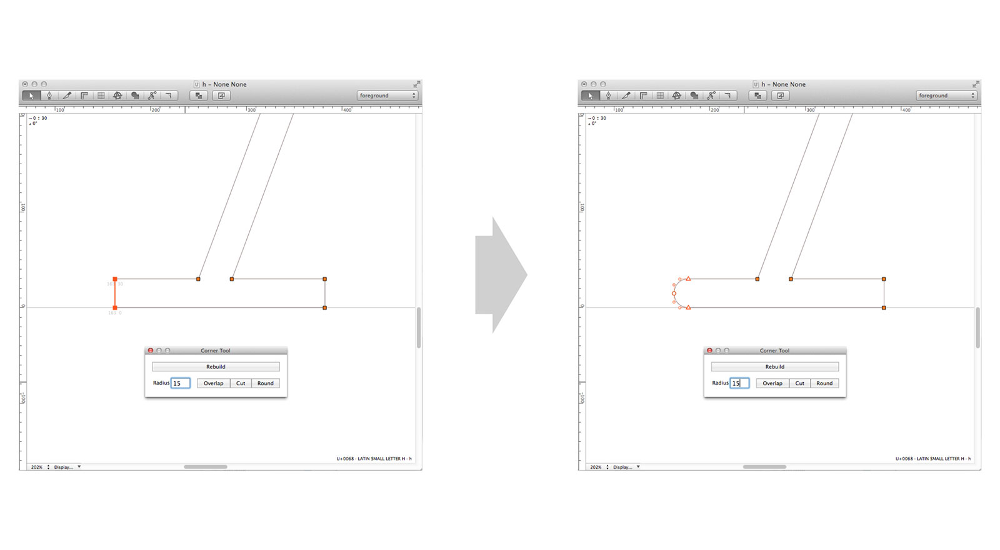

## Corner Tools
================

This extension is a set of tools to work on corners of an outline. It comprises a tool available in the glyph editing view that allows you to round/cut corners by dragging to define the radius, and a pop-up window (accessible via the Extensions menu, under Corner Tools) which provides a more global set of controls.

### Glyph view rounding tool

#### Actions
+ **Double-click**: apply rounding
+ **Command+Double-click**: reset all radiuses

#### Holding modifier keys
+ **Shift**: radius steps 5 by 5
+ **Option**: make a flat corner rather than round
+ **Shift**+**Command**: reset radius

### Corner Tools controller

#### What you can do to corners:
+ **Rebuild** (from round or flat)

+ **Overlap**

+ **Cut** (also available via the Rounding Tool)

+ **Round** (also available via the Rounding Tool)

