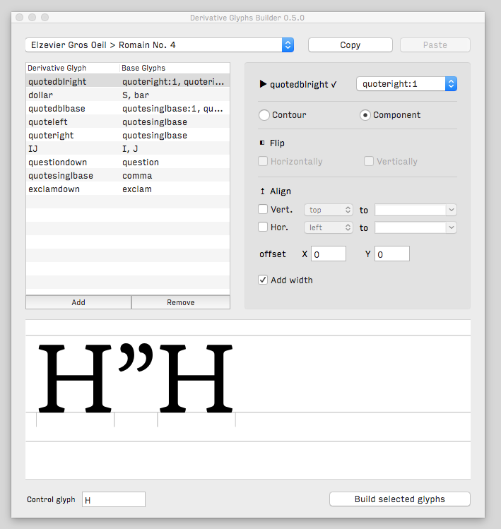
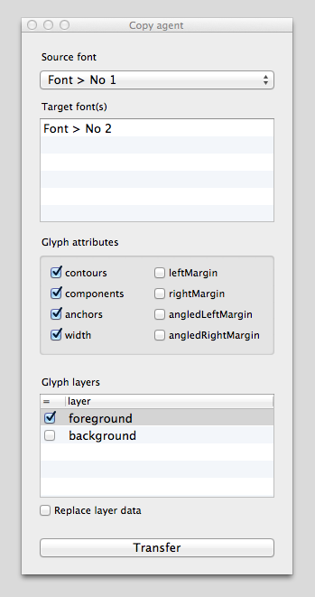

Glyph Tools
================

## build-derivatives.py

Tool that allows the user to define and build new glyphs by duplicating/associating other ones.

Each glyph definition is stored per font and is selectively transferable from one font to another.

A definition can refer to as many glyphs as you want (in the limits of sanity of course). 

[See it in action](https://vimeo.com/120873935)

**Notes** 
+ If you wish to refer to the same glyph several times, you should append a number to its name when you put it in, following a glyphname:number syntax. For example: ellipsis —> [period:1, period:2, period:3]
+ If you fail no number several occurrences of the same name, it will count as only one base glyph.
+ Flipping is only allowed if the base glyph you refer to is copied as contour, not as a component (it’s probably for your own good).
+ You can defined horizontal or vertical alignments by providing which side (or center) of the glyph to align and to which dimension. Dimensions can be numbers input directly but you can can also refer to the fonts metrics or other glyphs. For instance: align [top] to [capHeight]. When you wish to center a glyph vertically, keep in mind that the value you refer to is the axis on which to center the glyph. Thus, if you wish to center a glyph in the capHeight, you should say [center] to [midCapHeight].
+ For each definition, the script evaluates if the definition is valid, shown by a checkmark or cross next to the glyph’s name in the definition. It is shown as invalid if the base glyph doesn’t exist in the font, or isn’t defined in another valid definition.   It also checks if you’re making nested components and doesn’t agree. Nevertheless, it will only fail in the former case, not having a proper base glyph to work with.

## transfer-glyphs.py

Utility to transfer glyphs from a font to another, or several others. Not all data has to come along. 

At some point, you might wonder why the script isn’t doing anything, if so, double-check that:
+ 1. you do have glyphs selected 
+ 2. you do have (a) target font(s)  selected.

NB: [replace layer data] only replaces data for checked boxes, it doesn’t clear a layer’s content. 

