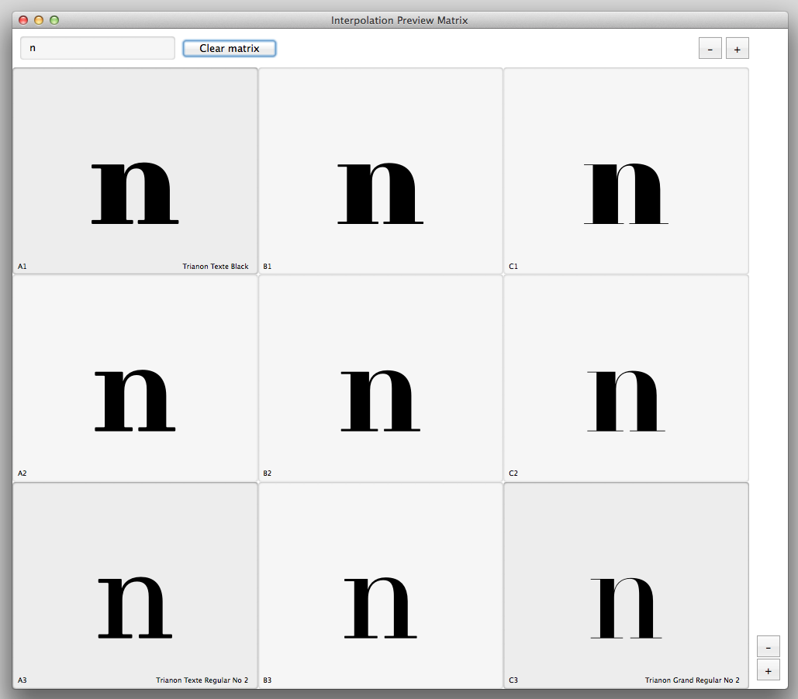
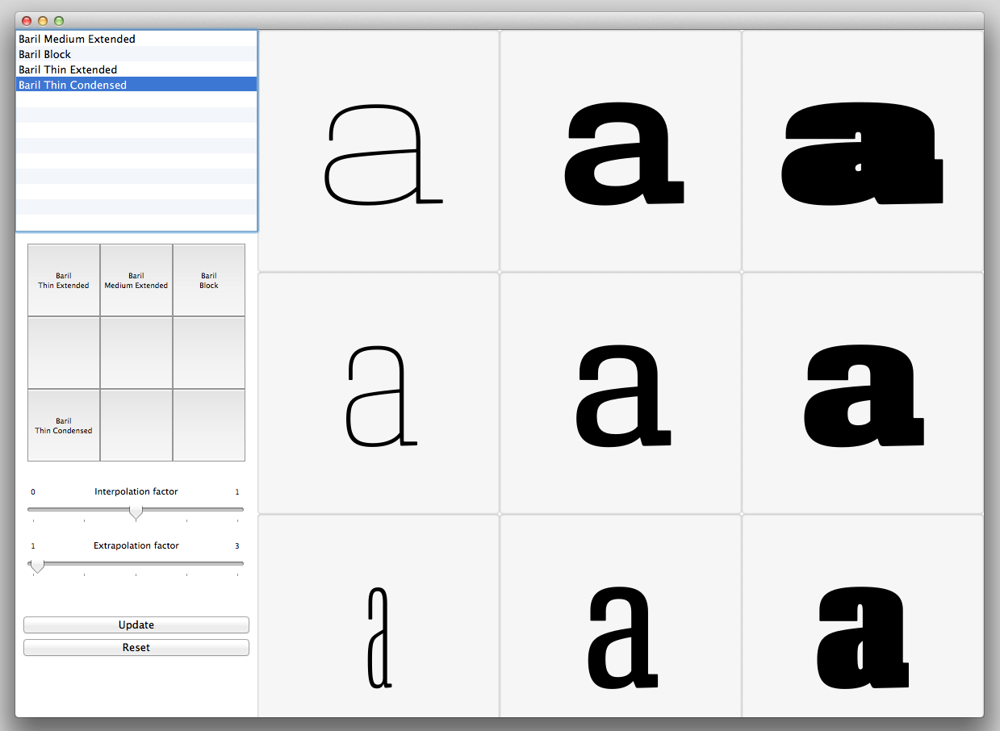

## Interpolation preview matrix (MutatorMath)
================

**Note! this version of the Interpolation Matrix will work only from ROBOFONT v1.6 onward, for previous versions of Robofont, use the previous script [see below].**

Script requiring at least two master fonts open in Robofont and interpolable glyphs which allows you to preview interpolation and extrapolation based on master position in an up to 20x20 matrix.

This version of the script (suffix -mutatormath) is a rewriting of the previous Interpolation Preview Matrix (see below) now using , whereas previous inter/extrapolations where customly written for this script.

The glyphs are updated (almost) at draw time [mouseUp, keyUp], so you can modify glyphs and see changes happen in the matrix. Theoretically, you can have a 20x20 matrix of 400 fonts. But I guess it would get rather slow if you wish to monitor changes on so many outlines while drawing…

## Interpolation preview matrix
================

Script requiring at least two master fonts open in Robofont and interpolable glyphs which allows you to preview interpolation and extrapolation based on master position in a 3x3 matrix.

The glyphs are updated at draw time, so you can modify glyphs and see changes happen live in the matrix (blue pill!). 
