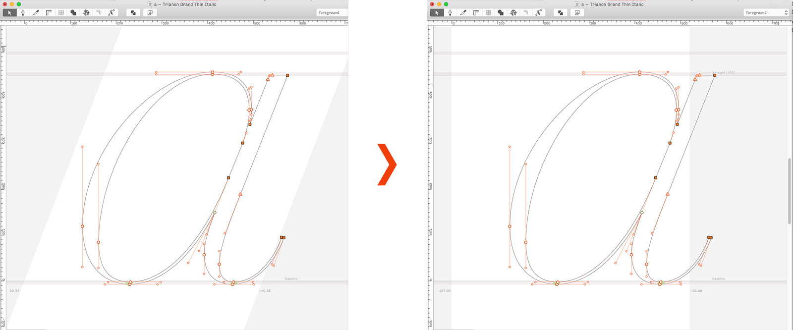
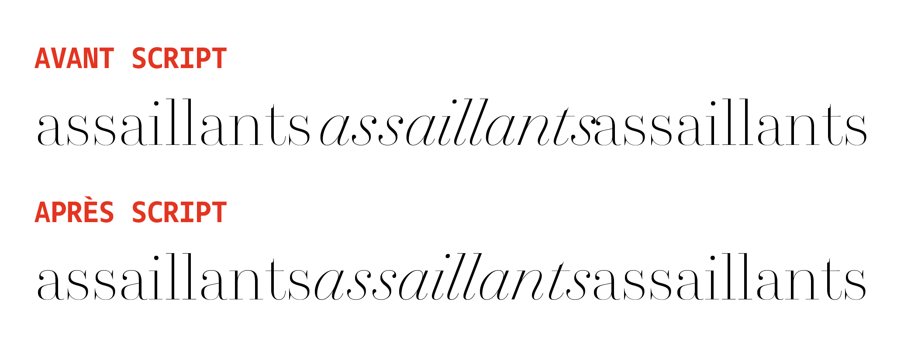

Metrics scripts
================

## shift-metrics-italic-to-upright.py

Script to help with the ‘italic angle’ feature. 

Robofont has a very useful option that allows you to display the italic angle of a font in such a way that you can space glyphs as you would roman/upright glyphs, instead of having to use upright sidebearings on slanted shapes.

This feature has a little drawback however, due to the fact that binary fonts don’t support angled sidebearings (or I’ve been misled to think that), so a generated font will use upright values. Your spacing *will* remain intact, but if you try to use the italic in the midst of a text set in roman, the italic word will appear off, shifted to the right. To solve that, you simply need to shift the whole set of italic glyphs to the left before generating. Easier said than done. The task isn’t overly complex, but finding the right value to shift glyphs is one of those tasks for which a computer will probably do a better job than you would.

With this script, you can go back and forth from straight to angled sidebearings. To calculate the shift value, the script needs to know on which base glyph you’d like to retain equal sidebearings (which presupposes you point towards a glyph that naturally has equal sidebearings, like a lowercase or uppercase O). By default, it will apply the shift to all glyphs in the font, but you can specify glyph sets if you wish to have different shifts per groups of glyphs. For instance, shift all uppercase glyphs so that uppercase O is centered in its width, and shift all lowercase so that lowercase o is centered in its width. This would effectively result in a gap between capitals and lowercase letters, but hey, if you’re getting into that, you should know what you’re doing anyway.
