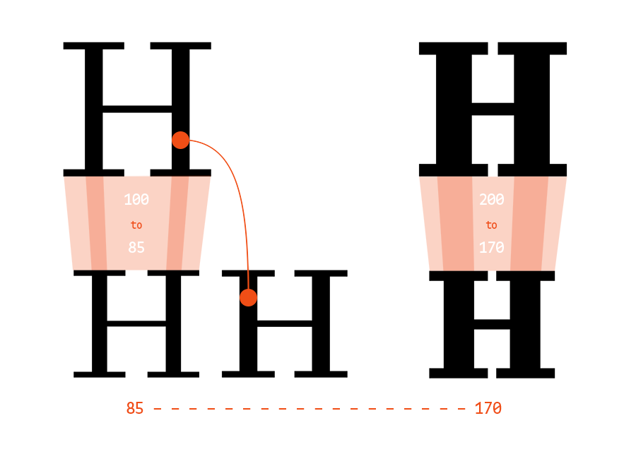

# MutatorScale

*[work in progress… eventually, this will replace the lengthy chatter on ScaleFast]*

Here’s an introduction to MutatorScale, a code extension to Letterror’s MutatorMath and a scripting tool meant to be used inside Robofont.

It consists of a little set of objects — I wouldn’t go as far as to call it a library —, the most important and central one being what I call a MutatorScaleEngine.

Its function is to build an interpolation design space, based on MutatorMath, with which it is rendered easier to scale glyphs while compensating for the loss of weight and/or contrast by interpolating. Such operations imply that you have at least two interpolatable fonts to begin with.

Nota Bene: It is the same idea as in my ScaleFast extension for Robofont, only this version of the code is better written and can be used via scripting. I intend to update ScaleFast with this in a not too distant future.

## Overview

Here’s how it goes. Providing you have a couple of interpolatable fonts, you can produce a wide range of derivative glyphs the design of which can be summed up as scaled down versions of others; the infamous example being small capitals. I’ll leave the  ‘Small caps should be drawn’ purists to their romantic views and assume you’d love to hear more about generating small caps, among other things.

You start by building a MutatorScaleEngine, feeding it fonts it can interpolate from:

```python
scaler = MutatorScaleEngine(fonts)
```

Next, you provide information about the scaling you wish to perform. This can go two ways. The first and most direct one:

```python
scaler.set({ ’scale’: 0.8 })
```

At all times, the .set() method of a MutatorScaleEngine is fed a dictionary containing scaling information. The alternate way to define your scaling goes like this:

```python
scaler.set({
	‘width’: 1.03,
	‘referenceHeight’: ‘capHeight’,
	‘targetHeight’: 520
})
```

This way may seem less straightforward in terms of code but is closer to design. You provide the required meaningful proportions that allow the MutatorScaleEngine to compute scaling values.

**width** corresponds to simple horizontal scaling and should be a float value akin to a percentage (100% == 1).

**referenceHeight** can be either a string or an number (float or int), but if it is a string, it should be a height reference the master fonts know about: vertical metrics.

**targetHeight** is the height you wish to see your scaled glyphs have; should be a number (float or int).

From these values, the MutatorScaleEngine computes proper scaling ratios. The interesting aspect in this approach is that the scaling ratios may vary among interpolation masters so that you can effectively interpolate glyphs from fonts with slightly different vertical metrics/proportions and still obtain scaled glyphs at the exact proportion you asked for — what it means concretely is that you could interpolate an ’H’ scaled down to 520 units in height from two master fonts with different capHeights.

*****

Once scale and fonts are set, the MutatorScaleEngine is ready to produce scaled glyphs, on demand.

Now if we ask:

```python
scaledGlyph = scaler.getScaledGlyph(‘H’, stems)
```

We get a new scaled letter H.

With **glyphName** (‘H’ or ‘a’), I’ve also provided a **stems** variable and it is a crucial part of the process, so I’ll elaborate on that.

When fonts are provided to a MutatorScaleEngine, it does a quick analysis to be able to place them in an interpolation space. It measures reference stems for each font so that you can later ask for scaled glyphs with a specific stem value. Working with stem values is arbitrary and you can actually override this if you’d rather work with some other values that are more meaningful to you, but I’ll get into that later on.

Stems are measured on uppercase I and H, to get both a vertical and horizontal stem value of reference.

As reference values are based on an H’s vertical and horizontal stems, you should use these as a reference when you scale glyphs and ask for specific stem values.

In effect, if you ask:

```python
scaler.getScaledGlyph(‘H’, (100, 20))
```

You’re asking for a scaled glyph ‘H’ that has 100 units for its vertical stems and 20 for its horizontal stems. If you ask for another glyph with these same values, you’re not asking to obtain that specific glyph with exactly these stem values but you’re asking for a scaled glyph, say ‘A’, with stems as they should consistently be next to an H with stem values of 100 and 20.

## Going Deeper

Here I’ll focus on what’s happening inside a MutatorScaleEngine.  As the name indicates, I got the idea from using MutatorMath and MutatorScale depends totally on MutatorMath’s mojo.

To understand how glyphs are scaled down and corrected, you should first grasp how MutatorMath functions even if it’s just a general understanding.

The whole point of MutatorMath is to define a design space for interpolation. The word *space* is meant quite literally here because one of the key objects of MutatorMath is a **Location**.
With well defined key Locations (= masters), you obtain an axis on which you can move and retrieve interpolated information.

The simplest design space one could think of probably looks something like this:

```
myAxis
0 – – – – – – – – – 10
```

Here’s an axis defined by two key Locations with values of 0 and 10. However far you go into mutatorMath, interpolating glyphs, kerning, whole fonts, etc. it always comes down to numbers on a line.

The axis also has a name because we might have only one for now, but a MutatorMath design space can contain as many axes as you want.

Defining such an axis is almost as easy as defining two locations, like this:

```python
Location(myAxis=0)
Location(myAxis=10)
```

Now we have key Locations, but to turn these in masters, we need to link these Locations to data, and this data has to be able to function like a number, or simply, be a number.

So, let’s represent the axis with masters, like this:

```
myAxis
Locations      0 – – – – – – – – – 10
               |                    |
Master values  0 – – – – – – – – – 20
```

Now that an axis is properly defined, you can ask MutatorMath to provide you a value for any Location along that axis. This axis is quite simple, it maps Locations to numbers that double the value of a Location’s position.

```
myAxis
Locations      0 – – – – – – – 8 – 10
               |                    |
Master values  0 – – – – – – – ? – 20
```

So if you now ask for the value of this Location(myAxis=8), MutatorMath will return 16. This returned value, 16, is called an instance.

Here’s how you write the whole thing above:

```python
# Make a list of masters
# Each master must be defined by 1. a Location, 2. a master (value)

masters = [
	(Location(myAxis=0),   0),
	(Location(myAxis=10), 20)
]

# Here comes MutatorMath

b, mutator = buildMutator(masters)

# Now that a mutator is built, with the masters you provided,
# you can ask it for instances at a specific Location


instance = mutator.getInstance( Location(myAxis=8) )

> 16
```

Now let’s up our game. If I do the same, but using glyphs instead of numbers as master values, I can build the following:

```
myWeightAxis
Locations      0 – – – – – – – - – 100
               |                    |
Master values  a – – – – – – – - –  a

               R				    B
			   e                    o
			   g                    l
			   u                    d
               l
               a
               r
```

Now, if I build a mutator as I did above, getting an interpolated glyph is as simple as:

```python
interpolatedGlyph = mutator.getInstance( Location(myWeightAxis=50) )
```

Most of the time with glyph interpolation, we use Location values that correspond to some weight measuring system (0 to 1000, 100 Thin, 300 Light, 400 Regular, etc.). But the numbers you use for locations can be anything. In MutatorScale I used stem values because that’s the thing I wanted to keep track of. If you build a mutator with stem values, you can effectively ask for an interpolated glyph with specific stem values.

From this starting point, the only additional thing done my a MutatorScaleEngine is to build a mutatorMath space of scaled glyphs, defining masters by their scaled stem values and asking for instances with unscaled stem values.

Let’s say I have two masters, a Regular and a Bold. In the regular weight, an H’s vertical stem is 100 units wide, and in the bold weight, 200 units. If I’d like to obtain a regular small capital H with vertical stems of 100 units and scaled down 85% in width and 80% in height, here’s what I have to do:

```python

# Scale down master glyphs to 0.85 width and 0.8 height
regular_H.scale((0.85, 0.8))
bold_H.scale((0.85, 0.8))

# Calculate scaled down stem values
scaled_regularStem = 100 * 0.85 # = 85
scaled_boldStem = 200 * 0.85 # = 170

# List masters with scaled glyph and scaled stem values

masters = [
	( Location(stem=scaled_regularStem), regular_H ),
	( Location(stem=scaled_boldStem), bold_H )
]

# Build a mutator of these scaled elements

b, mutator = buildMutator(masters)

# Ask for an instance of a scaled glyphs with an unscaled stem value, 100 for regular

smallH = mutator.getInstance( Location(stem=100) )
```



Now we retrieved a scaled down ‘H’ glyph with weight identical to a unscaled ‘H’, and that’s the basic operation happening inside of a MutatorScaleEngine. 
