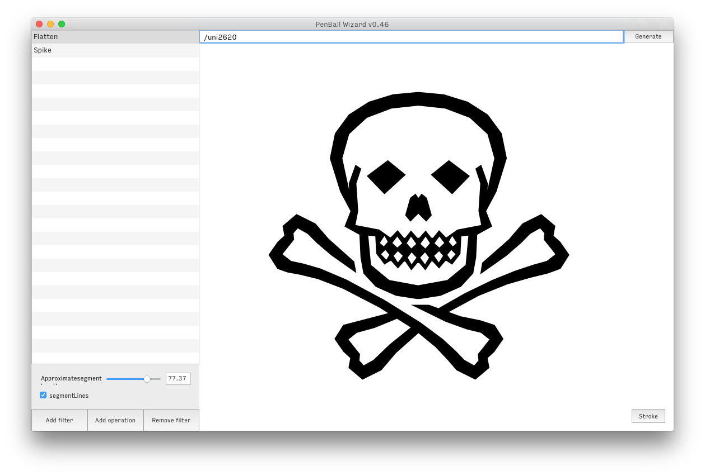
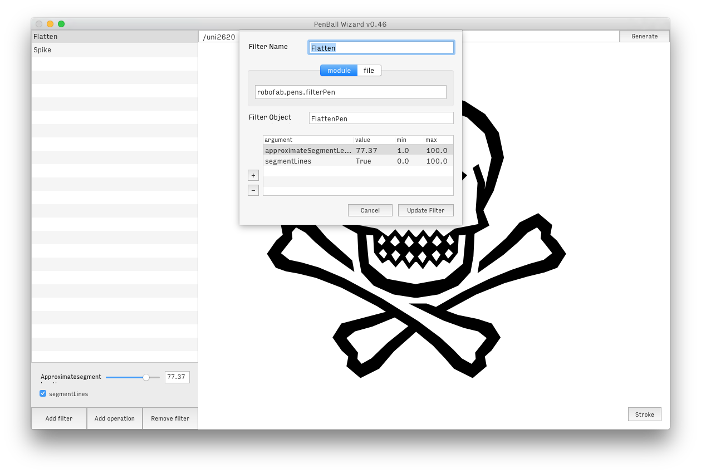
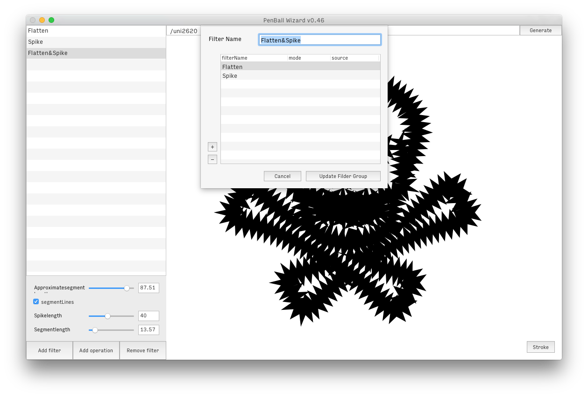
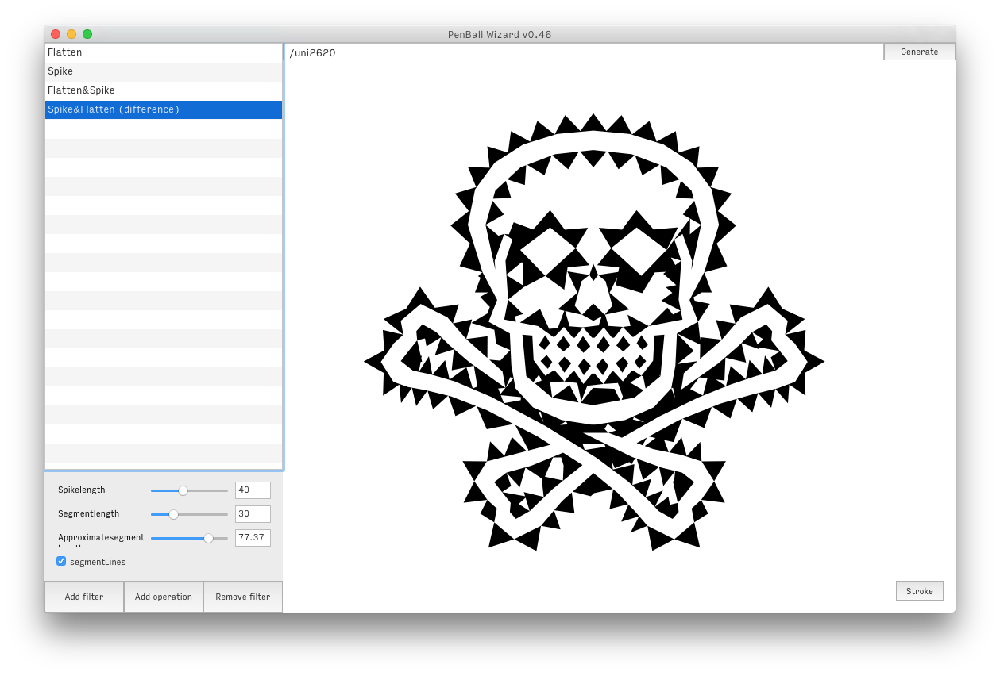
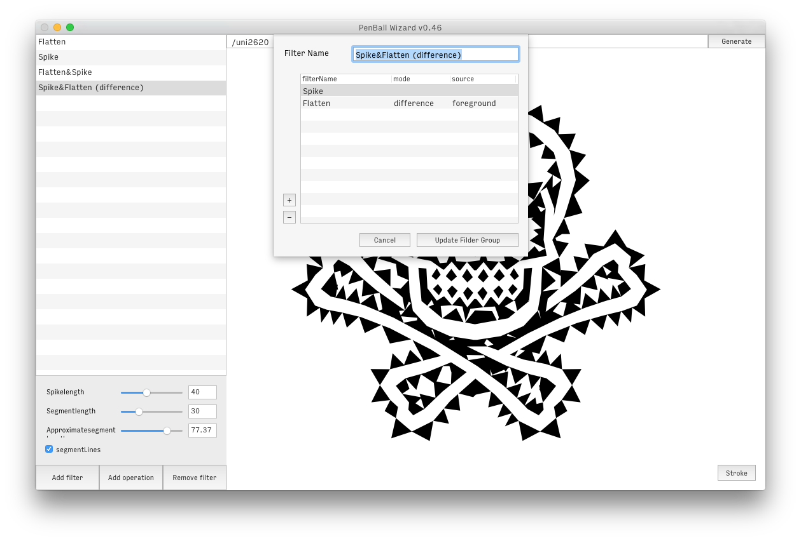

PenBall Wizard
================

## Overview

This extension is a helper for the wielding of [robofab pens](http://www.robofab.org/objects/pen.html) and functions that transform a glyphs outline. The interface is thought to manage ‘filters’, and see a preview of their effects. A filter is added either by indicating a module importation string that links to existing & installed pens or functions, or by pointing to a file from which a pen or function will be imported on the fly. For each new filter, you also indicate the name of the pen or function as well as possible arguments, which will result in UI controls for each argument.

If you provide pens, they should work according to this pattern: ```pen = MyFilterPen(otherPen, **arguments)```, if you want to use a pen that doesn’t receive another pen as argument, you should provide an intermediary function that handles the pen and returns a filtered glyph.

You can find pens to get started with [here](https://github.com/loicsander/RobofabPens).

## Usage

**Single filter**




*****

**Operations filter**
Filters can be defined as a succession of filters and/or boolean operations:




When defining an operation, you call existing single filters by name and you have a couple of options for each filter in the process. By default, at each step, the glyph is filtered and returned to be passed to the next filter. The ```mode``` option allows you to define how the glyph is passed on to the next step. 

Here are the possible arguments for the mode option:
+ ```add```: add filtered glyph on top of the existing glyph instead of filtering the existing
+ ```union```: —> [BooleanOperations](http://doc.robofont.com/api/robofab-extras/boolean-glyph/)
+ ```intersection```: —> [BooleanOperations](http://doc.robofont.com/api/robofab-extras/boolean-glyph/)
+ ```difference```: —> [BooleanOperations](http://doc.robofont.com/api/robofab-extras/boolean-glyph/)




The ```source``` value is used to changed the source glyph, possibly at each step if you feel like it. If the cell remains empty, each operation receives the previously filtered glyph. However, you can change that by providing either layer names or numbers that correspond to previous steps. It allows you to either use the original glyph by asking for ```'foreground'``` (used to be ```initial = True```), but you can also get glyphs from other layers of the initial glyph or a specific filtered glyph.
This functionality makes it easy to create a filter that is only a succession of boolean operations between layers, for instance.

In an operation, you don’t necessarily need to call an existing filter. If at some step you simply wish to duplicate the existing glyph and only perform a boolean operation with it for instance, you can leave the ```filterName``` field empty or fill it with ```'copy'```.

## Exchanging filters between extensions

Alternatively, filters can be added by other extensions inside Robofont. An extension that has a pen or filter function can add it to the filters list when a PenBallWizard window is initiated. This is done by suscribing to the ```'PenBallWizardSubscribeFilter'``` event. The callback dictionary will contain a method allowing you to add your filter object to PenBallWizard’s list:

```python
from mojo.events import addObserver

def myFilterFunction(glyph, arg1=True, arg2=20):
    # does stuff on a glyph
    return filteredGlyph

class MyExtension:

    def __init__(self):
        addObserver(self, 'addFilterToPenBallWizard', 'PenBallWizardSubscribeFilter')

    def addFilterToPenBallWizard(self, notification):
        subscribeFilter = notification['subscribeFilter']
        # provide a filter name
        # and a dictionnary with the filterObject and arguments
        subscribeFilter('MyFilter', {
            'filterObject': myFilterFunction,
            'arguments': {
                'arg1': True,
                'arg2': 20
            }
        })
```
