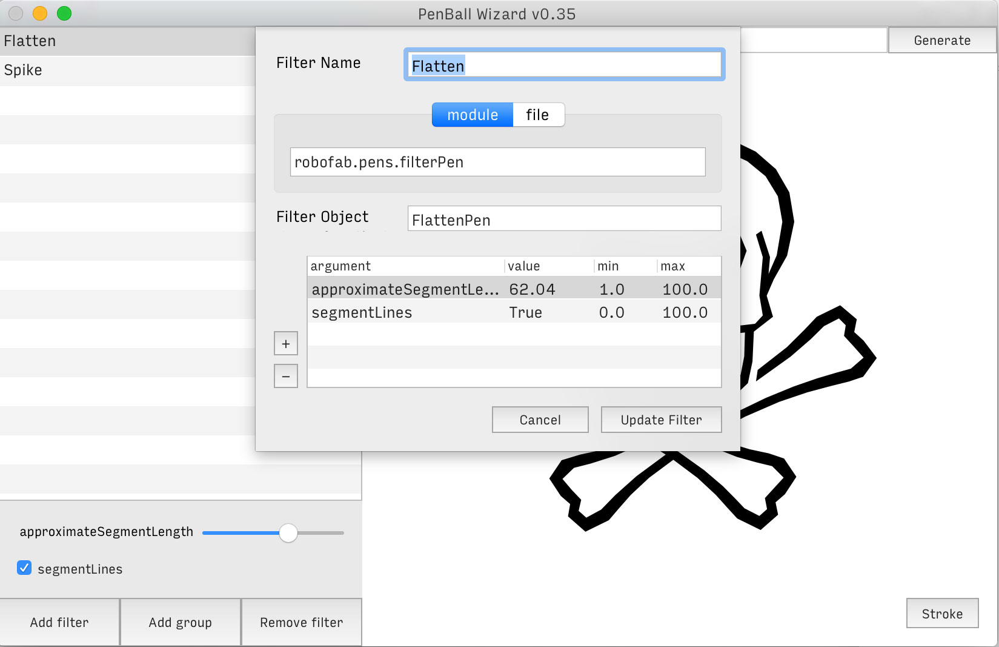
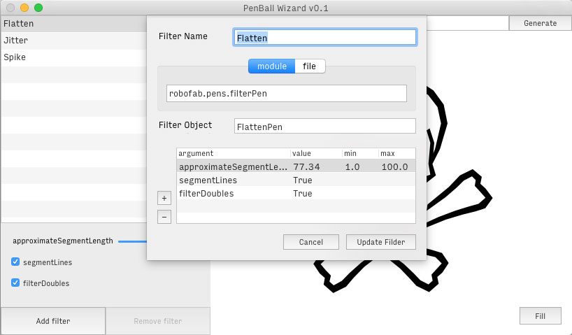
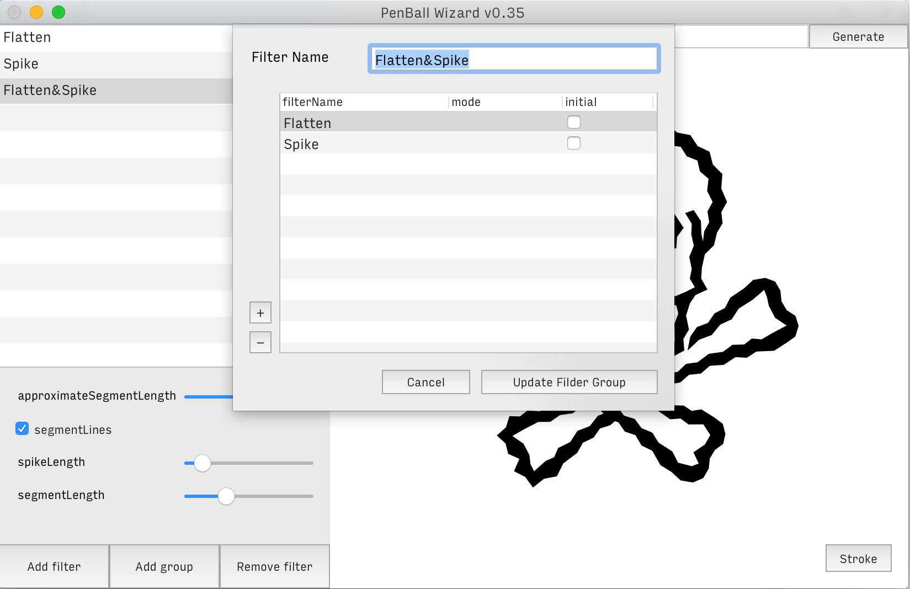
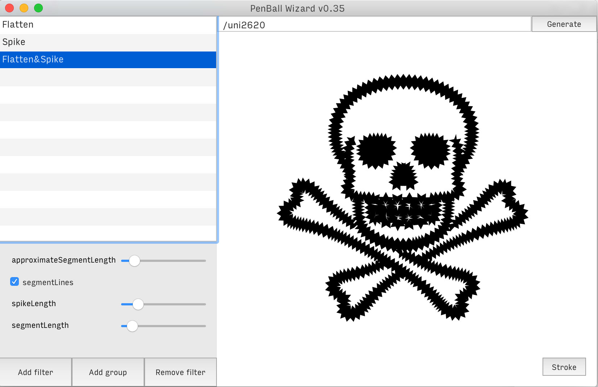

PenBall Wizard
================

This extension is a helper for the wielding of robofab pens and functions that transform a glyphs outline. The interface is thought to manage ‘filters’, and see previews of their effects. A filter is added either by indicating a module importation string that links to existing & installed pens or functions, or by pointing to a file from which a pen or function will be imported on the fly. For each new filter, you also indicate the name of the pen or function as well as possible arguments, which will result in UI controls for each argument.




Filters can be defined as a succession of filters:




When defining a filter group, you call existing single filters by name and you have a couple of options for each filter in the process. By default, at each step, the glyph is filtered and returned to be passed to the next filter. The ```mode``` option allows you to define how the glyph is passed on or even if a certain step in the process should not use the previously filtered glyph but rather the original unfiltered glyph and then mix it with the already filtered glyph. 

Here are the possible arguments for the mode option:
+ ‘add’: add filtered glyph on top of the existing glyph instead of filtering the existing
+ ‘union’: (see [BooleanOperations](http://doc.robofont.com/api/robofab-extras/boolean-glyph/))
+ ‘intersection’: (see [BooleanOperations](http://doc.robofont.com/api/robofab-extras/boolean-glyph/))
+ ‘difference’: [BooleanOperations](http://doc.robofont.com/api/robofab-extras/boolean-glyph/))

The ```initial``` value is used to tell a specific filter to use the original glyph instead of the filtered one if some filters have already been used in the process.
