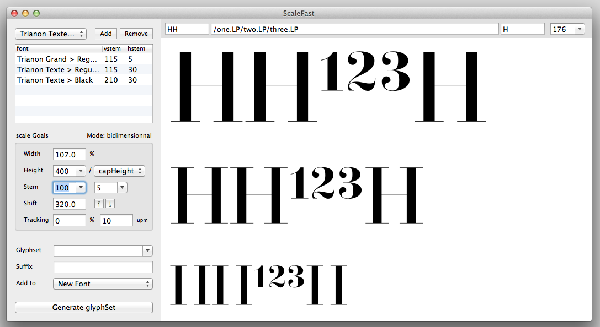

## ScaleFast
================

This is script’s mission is simple: keep stem widths consistent while you fiddle with proportions of a glyph. It manages that by trying to compensate for scale deformations through interpolation. To do that, it requires at least two masters (a regular and bold for instance). This way, you can easily produce scaled versions of existing glyph for any purpose you see fit, small capitals, superiors, condensed versions, scaled up, down, etc. The tool’s flexibility comes a great deal from its relying on MutatorMath, written by Erik van Blokland.

### How it works

To get the best possible results, here’s a few explanations about how this script works. When you add masters (as many as you like), they are analysed for vertical & horizontal stem width (based on I’s stem and the horizontal bar of H). These values are then used as reference point to build an interpolation space (with help of MutatorMath). It doesn’t really matter that these values are the right ones for stem width (although, if you wish to input stem values, it’s better if they are). That is to say that you could replace the master vstem/hstem values by increments between 0 & 1000 as is usually the case in interpolation schemes, you would then have to input values between 0 & 1000 instead of stem values, the script doesn’t care what you chose, the same way Superpolator doesn’t care what system of numbers makes the most sense to you, it can handle them all.
Anyhow, this tool was built around the idea of stem width, to make it easier to keep stem width consistent when you scale down a glyph, for instance (you can also scale it up, stretch it horizontally, etc. whatever floats your boat).
As the interpolation is based on MutatorMath, the dream use-case for this tool is having masters that allow for two-axes interpolation. If conditions aren’t met (they wouldn’t be for a simple regular/bold couple), interpolation works as simply as it can, in either an isotropic way (x & y values are interpolated proportionnaly) or anisotropic (x & y values can be interpolated separately, which can provide useful control at times).
If conditions for two-axes interpolation are met, the script automatically switches to a ‘bi-dimensional’ mode. For example, if you have master for weight and other for contrast, and they are compatible. You’ll be able to scale glyphs while controlling either weight and contrast at the same time, independently.

