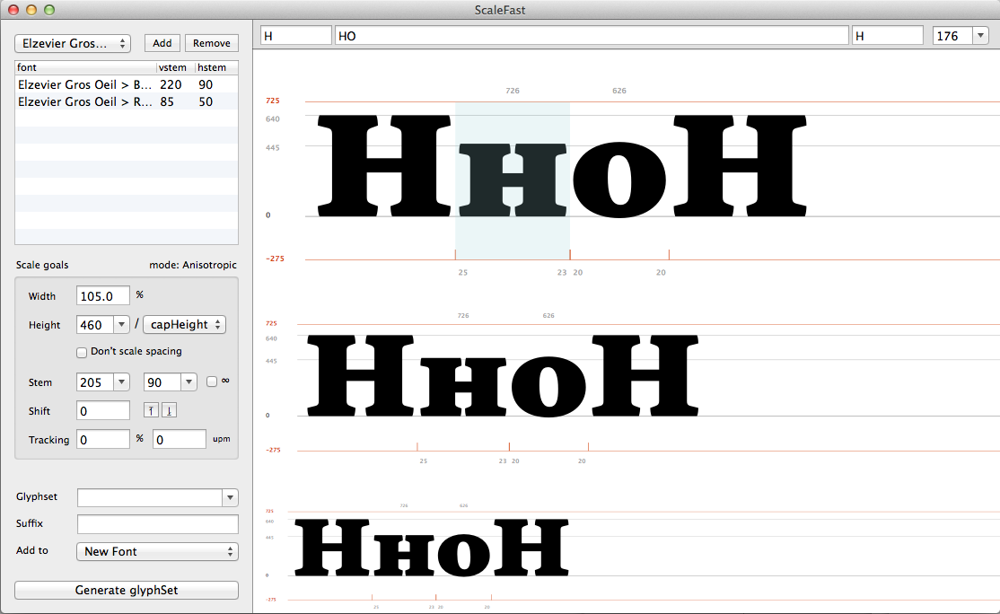
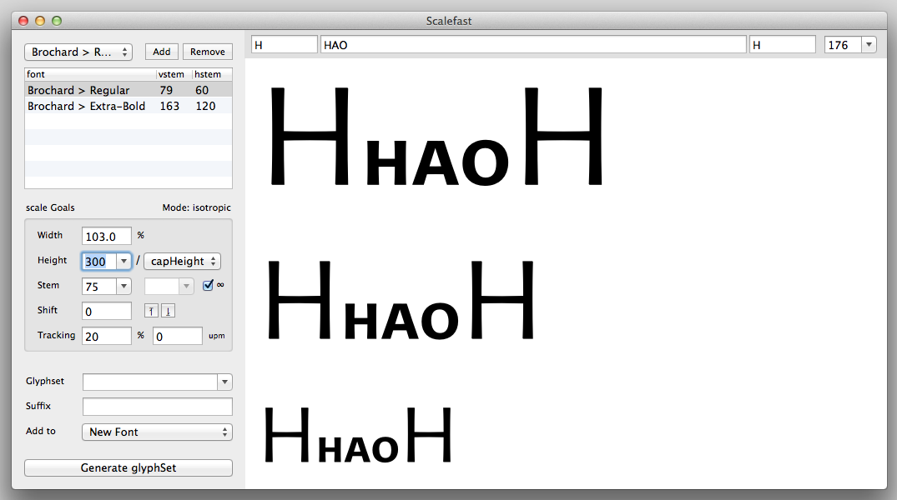
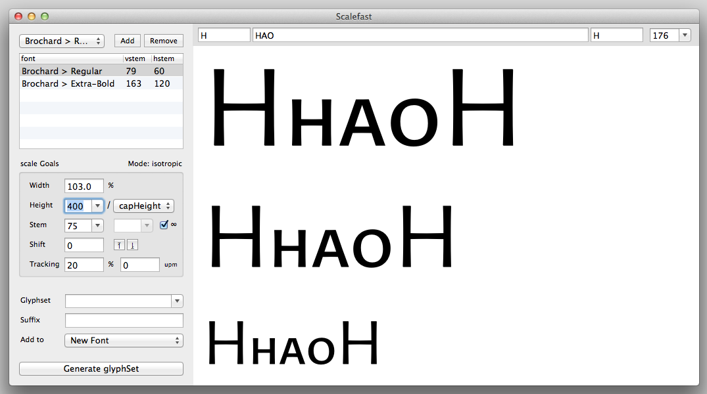

## ScaleFast
================

This script’s mission is simple: keep stem widths consistent while you fiddle with proportions of a glyph. It manages that by trying to compensate for scale deformations through interpolation. To do that, it requires at least two masters (a regular and bold for instance). This way, you can easily produce scaled versions of existing glyph for any purpose you see fit, small capitals, superiors, extended or condensed styles, scaled up, down, etc. 
*The tool’s flexibility comes a great deal from its relying on , written by Erik van Blokland.*

### How it works

To get the best possible results, here’s a few explanations about how this script works. 

When you add masters (as many as you like), they are analysed for vertical & horizontal stem width (based on I’s stem and the horizontal bar of H). These values are then used as reference point to build an interpolation space (with help of MutatorMath). 

It doesn’t really matter that these values are the right ones for stem width. These values are used as reference points when you put values in the stem input fields. So if the reference values are actual stem values, this means that you can put in stem values in the stem field as well, and that’s what you get as output. Remember, the value you ask for is true for a capital H’s stem. That’s the way the tool was built to be used, ideally. But if you’d rather make your masters stem values on the 0 to 1000 scale, if will work all the same, only you won’t ask for a stem of 120 units between masters that have stems of 80 and 200, you’ll be asking a instance of 700 between masters of say, 300 and 1000.

Anyhow, this tool was built around the idea of stem width, to make it easier to keep stem width consistent when you scale down a glyph, for instance (you can also scale it up, stretch it horizontally, etc. whatever floats your boat). So I’d recommend you stick to that.

As the interpolation is based on MutatorMath, the dream use-case for this tool is having masters that allow for two-axes interpolation. If conditions aren’t met (they wouldn’t be for a simple regular/bold couple), interpolation works as simply as it can, in either an isotropic way (x & y values are interpolated proportionnaly) or anisotropic (x & y values can be interpolated separately, which can provide useful control at times).

If conditions for two-axes interpolation are met, the script automatically switches to a ‘bi-dimensional’ mode. For example, if you have masters for weight and others for contrast, and they are compatible. You’ll be able to scale glyphs while controlling either weight and contrast at the same time, independently.

